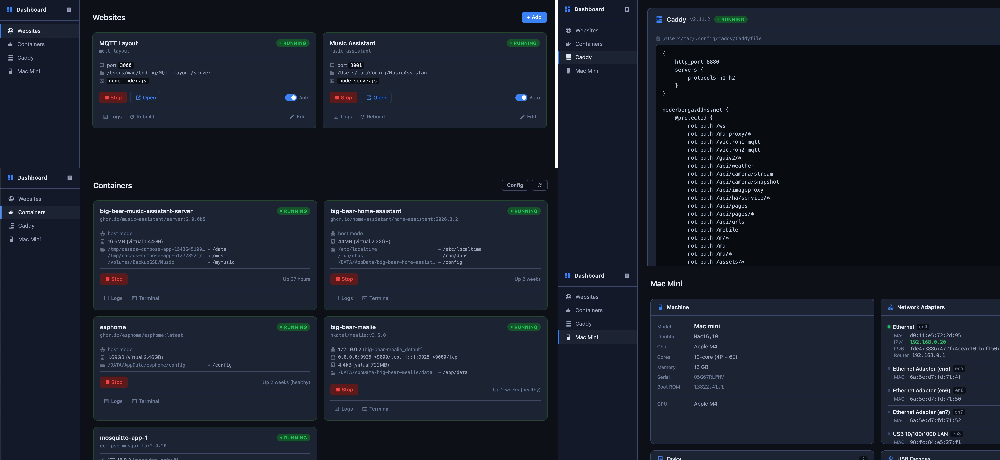

# Site Dashboard

A self-hosted server and network dashboard running on a Mac mini, built with Vue 3 + Vite frontend and a Node.js/Express backend.



## Features

### Websites
- Monitor and manage hosted websites
- Per-site process start/stop and build triggers
- Open button uses the dashboard server's IP address (not localhost)
- Live log streaming (SSE) with save to disk

### Containers
- View all Docker containers (via Colima)
- Start/stop containers
- Live log streaming per container
- Interactive terminal via xterm.js (WebSocket + node-pty)
- Colima config editor with save and backup

### Caddy
- View Caddy running status
- Full-screen config file editor
- Start / stop / reload controls
- Live Caddy log streaming

### Mac Mini
- Hardware overview (chip, memory, serial)
- Network adapters (IP, MAC, speed, router)
- Disk usage with visual progress bars
- USB device tree (via `ioreg`, works on Apple M4)
- GPU / display info
- Auto-refresh every 15 seconds

### Machines
- Monitor all machines on the local network
- Online / offline status via heartbeat (60s timeout)
- Shutdown machines remotely via the dashboard agent
- Wake machines via Wake on LAN (magic packet UDP broadcast)
- Machines auto-register on boot with IP, MAC address and OS
- Connection type detection (WiFi / Ethernet)

### TVs
- Monitor Philips and LG TVs on the local network
- Online / offline status with three-state display (checking / online / offline)
- Wake on LAN and power off per TV
- Full IR remote control web UI for Philips TVs (JointSpace API)
  - Matches the real RC4836/01 remote layout
  - All keys: D-pad, volume, channels, media controls, color buttons, number pad
- TV cards show instantly from config; online checks run in the background

### Client IPs
- List all clients on the network via UniFi controller API
- Hostname, IP, MAC address per client

### Print Report
- Printable network report with Colima config, machine list and site info
- Sidebar hidden on print, proper page breaks

### Dashboard Agent (`dashboard-agent/`)
- Lightweight Node.js agent that runs on each managed machine
- Registers with the dashboard on startup and sends a heartbeat every 30s
- Accepts `POST /shutdown` to trigger a system shutdown
- One-liner install for macOS and Ubuntu via `/install` page
- macOS: installed as a launchd system daemon (auto-starts on boot)
- Ubuntu: installed as a systemd service (auto-starts on boot, WoL enabled automatically)

### MQTT Bridge
- Publishes machine and TV status to an MQTT broker (retained messages)
- Topic structure:
  - `site_dashboard/machines/{id}/online` → `ON` / `OFF`
  - `site_dashboard/machines/{id}/state` → JSON `{name, online, ip, os, mac}`
  - `site_dashboard/tvs/{id}/online` → `ON` / `OFF`
  - `site_dashboard/tvs/{id}/state` → JSON `{name, online, brand, model, ip}`
- Subscribes to command topics for remote control:
  - `site_dashboard/machines/{id}/command` → `wake` / `shutdown`
  - `site_dashboard/tvs/{id}/command` → `wake` / `poweroff` / `key:<KeyName>`
- Used by [MQTT_Layout](https://github.com/netbox123/MQTT_Layout) for Machine and TV dashboard cards

### GUI (`/gui`)
- Minimal full-screen overview page
- Websites, Machines and TVs with live status and control buttons
- Full Philips TV remote accessible from the TV card
- Auto-refreshes every 5s (websites) and 10s (machines/TVs)

### Install Page (`/install`)
- One-liner install commands for macOS and Linux
- Full script preview with copy button
- WoL setup instructions per platform

### Dashboard Log
- Sidebar button streams the server's own console output in real time
- Save log to disk

## Tech Stack

| Layer | Technology |
|---|---|
| Frontend | Vue 3, Vite, @mdi/js |
| Backend | Node.js ESM, Express |
| Terminal | xterm.js, node-pty, WebSocket |
| Logs | SSE (Server-Sent Events), JSONL |
| Containers | Docker via Colima |
| Reverse proxy | Caddy |
| Hardware info | `system_profiler`, `ioreg` |
| Wake on LAN | UDP magic packet via `dgram` |
| TV control | Philips JointSpace REST API, LG WebOS |
| MQTT | mqtt.js (broker bridge, retained messages) |
| Network clients | UniFi controller API |
| Agent auto-start | launchd (macOS), systemd (Ubuntu) |

## Setup

```bash
# Install dependencies
npm install
cd frontend && npm install && npm run build && cd ..

# Copy and edit config files
cp config/mqtt.example.json config/mqtt.json
cp config/unifi.example.json config/unifi.json
cp config/tvs.example.json config/tvs.json

# Start the server
node server.js
```

Server runs on **port 9000** by default.

## Configuration

| File | Description |
|---|---|
| `config/site.json` | Site name, address and contact info for reports |
| `config/mqtt.json` | MQTT broker connection (credentials) |
| `config/unifi.json` | UniFi controller URL and API key |
| `config/tvs.json` | TV list (IP, MAC, brand, model) |
| `config/machines.json` | Auto-populated by agent registrations |
| `config/pages.json` | Sidebar page definitions |

Use the `*.example.json` files as templates.

## Installing the Agent on a Machine

Visit `http://<dashboard-ip>:9000/install` and run the one-liner for your OS:

```bash
# macOS
curl -fsSL http://<dashboard-ip>:9000/api/install/mac | sudo bash

# Ubuntu / Debian
curl -fsSL http://<dashboard-ip>:9000/api/install/linux | sudo bash
```

The agent runs on **port 9001** and registers itself with the dashboard automatically.

## Project Structure

```
Site_Dashboard/
├── server.js                   # Express + WebSocket server
├── config/
│   ├── pages.json              # Sidebar page definitions
│   ├── site.json               # Site info for reports (empty template in repo)
│   ├── mqtt.example.json       # MQTT broker config template
│   ├── unifi.example.json      # UniFi config template
│   └── tvs.example.json        # TV list template
├── dashboard-agent/
│   ├── agent.js                # Machine agent (runs on managed machines)
│   ├── package.json
│   └── install-mac.sh          # Manual macOS install script
├── frontend/
│   └── src/
│       ├── App.vue
│       ├── components/layout/Sidebar.vue
│       └── views/
│           ├── WebsitesPage.vue
│           ├── ContainersPage.vue
│           ├── CaddyPage.vue
│           ├── MacMiniPage.vue
│           ├── MachinesPage.vue
│           ├── TvsPage.vue
│           ├── ClientsPage.vue
│           └── PrintPage.vue
├── public/
│   ├── gui.html                # Minimal overview page (/gui)
│   └── install.html            # Agent install page (/install)
└── logs/                       # JSONL log files (gitignored)
```
